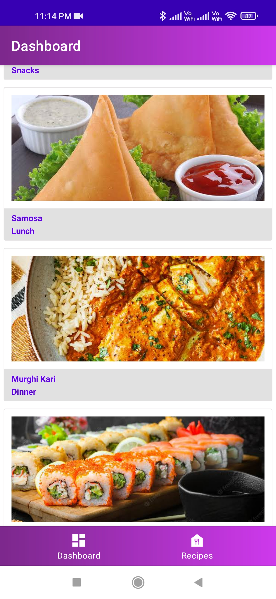

# RecipCreatorApp
**RecipeCreator Application** is a cooking application in which you can create and share your favorite cooking recipes with your firends, family and the world. A true
foody knows that presentation matters just as much as the taste therefore you can also take pictures of the delicious food recipes that you have created.
All the data in the Application is stored using **Firebase** and the application is coded in the **Kotlin** Language.

                               

                               

                              

                              

